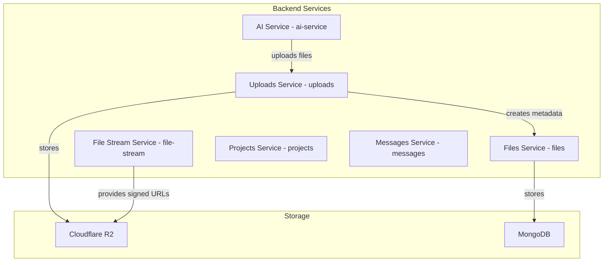
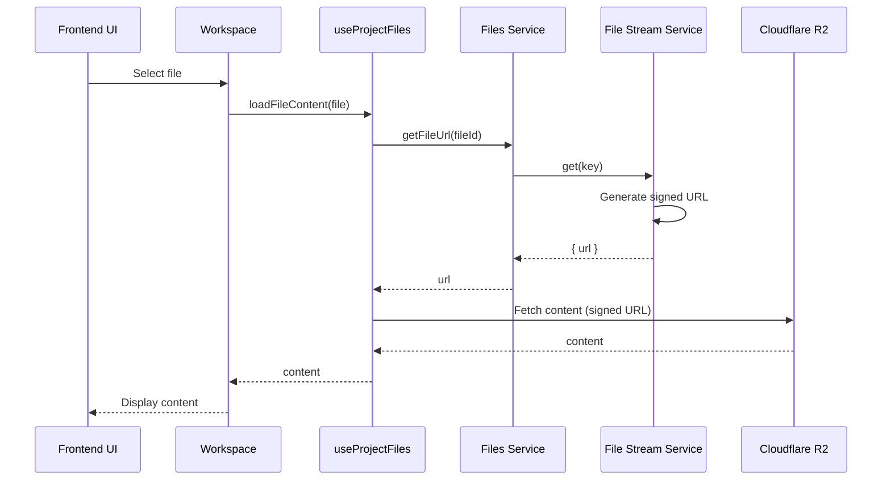

# Frontend-Backend Alignment Plan

## Executive Summary

This plan outlines the comprehensive alignment of the frontend with the updated backend structure and logic. The backend has undergone significant changes including:

1. **AI Service Response Format Change**: From JSON to markdown/key-value format
2. **File Upload Architecture**: New server-side R2 upload utility with proper multipart uploads
3. **Files Schema Updates**: Using `name`/`key` fields instead of `path`/`r2Key`
4. **New Services**: `file-stream` service for signed URLs, `uploads` service for multipart uploads

## Current State Analysis

### Backend Structure



### Backend Schemas

#### Files Schema ([`../back/src/services/files/files.schema.ts`](../back/src/services/files/files.schema.ts:11))
```typescript
{
  _id: ObjectId
  projectId: ObjectId
  messageId?: ObjectId
  name: string           // The filename/key in R2
  key: string            // The R2 key (same as name)
  fileType: string       // Content type (e.g., 'python', 'text')
  size: number
  currentVersion: number
  createdAt: number
  updatedAt: number
}
```

#### Projects Schema ([`../back/src/services/projects/projects.schema.ts`](../back/src/services/projects/projects.schema.ts:11))
```typescript
{
  _id: ObjectId
  userId: ObjectId
  name: string
  description: string
  framework: 'fast-api' | 'feathers'
  language: 'python' | 'typescript'
  model: string
  status: 'initializing' | 'generating' | 'ready' | 'error'
  createdAt: number
  updatedAt: number
}
```

#### Messages Schema ([`../back/src/services/messages/messages.schema.ts`](../back/src/services/messages/messages.schema.ts:11))
```typescript
{
  _id: ObjectId
  projectId: ObjectId
  role: 'user' | 'system' | 'assistant'
  type: 'text' | 'file'
  content: string
  tokens?: number
  status?: string
  createdAt: number
  updatedAt: number
}
```

### AI Service Response Format

The AI service now returns files in a markdown/key-value format:

```
PROJECT_NAME: [project name]
PROJECT_EXPLANATION: [project description]
PROJECT_FILES:
### File: [filename]
```[language]
[file content]
```
```

The response includes `generatedFiles` array with:
```typescript
{
  filename: string
  originalFilename?: string
  content: string
  type: string
  fileId?: string
  fileUrl?: string
  size?: number
  uploadSuccess?: boolean
  uploadTime?: string
  error?: string
}
```

### Frontend Current State

#### Issues Identified

| Component | Issue | Severity |
|-----------|-------|----------|
| [`src/services/api/files.ts`](src/services/api/files.ts:4) | Uses `path`/`r2Key` instead of `name`/`key` | Critical |
| [`src/services/api/files.ts`](src/services/api/files.ts:4) | Uses `language` instead of `fileType` | Critical |
| [`src/services/api/files.ts`](src/services/api/files.ts:77) | References non-existent `r2` service | Critical |
| [`src/app/api/files/[fileId]/content/route.ts`](src/app/api/files/[fileId]/content/route.ts:19) | References `ai-files` instead of `files` | Critical |
| [`src/app/api/files/[fileId]/content/route.ts`](src/app/api/files/[fileId]/content/route.ts:30) | References `r2` instead of `file-stream` | Critical |
| [`src/hooks/useProjectFiles.ts`](src/hooks/useProjectFiles.ts:1) | File tree built from `path` field | High |
| [`src/containers/workspace/Workspace.tsx`](src/containers/workspace/Workspace.tsx:1) | No handling for `generatedFiles` from AI | High |
| [`src/containers/aiAgent/AIAgent.tsx`](src/containers/aiAgent/AIAgent.tsx:1) | No integration with AI service for file generation | Medium |
| [`src/hooks/useAIProject.ts`](src/hooks/useAIProject.ts:1) | Missing framework/language type validation | Medium |

## Alignment Plan

### Phase 1: Type Definitions Alignment

#### 1.1 Update Files Type Interface

**File**: [`src/services/api/files.ts`](src/services/api/files.ts:4)

**Changes**:
```typescript
export interface File {
  _id: string
  projectId: string
  messageId?: string
  name: string           // Changed from 'path'
  key: string            // Changed from 'r2Key'
  fileType: string       // Changed from 'language'
  size: number
  currentVersion: number
  createdAt: number
  updatedAt: number
}
```

**Rationale**: Backend schema uses `name` and `key` fields, not `path` and `r2Key`.

#### 1.2 Update Projects Type Interface

**File**: [`src/services/api/projects.ts`](src/services/api/projects.ts:4)

**Changes**:
```typescript
export interface Project {
  _id: string
  userId: string
  name: string
  description: string
  framework: 'fast-api' | 'feathers'  // Already correct
  language: 'python' | 'typescript'  // Already correct
  model: string
  status: 'initializing' | 'generating' | 'ready' | 'error'
  createdAt: number
  updatedAt: number
}
```

**Rationale**: Already aligned with backend schema.

#### 1.3 Add AI Service Response Types

**File**: Create new file `src/services/api/aiService.ts`

**Changes**:
```typescript
export interface AIServiceRequest {
  projectId: string
  prompt: string
  context?: string
  temperature?: number
  maxTokens?: number
  generateFiles?: boolean
}

export interface AIServiceResponse {
  success: boolean
  response: string
  generatedFiles?: GeneratedFile[]
  usage?: {
    promptTokens: number
    completionTokens: number
    totalTokens: number
  }
  error?: string
}

export interface GeneratedFile {
  filename: string
  originalFilename?: string
  content: string
  type: string
  fileId?: string
  fileUrl?: string
  size?: number
  uploadSuccess?: boolean
  uploadTime?: string
  error?: string
}
```

**Rationale**: Frontend needs to understand the AI service response format.

### Phase 2: API Services Alignment

#### 2.1 Update Files Service

**File**: [`src/services/api/files.ts`](src/services/api/files.ts:49)

**Changes**:
```typescript
export const filesService = {
  async find(query?: FileQuery): Promise<{ data: File[]; total: number; limit: number; skip: number }> {
    await feathersClient.authenticate()
    return await feathersClient.service('files').find({ query: query as Params<FileQuery> })
  },

  async get(id: string): Promise<File> {
    await feathersClient.authenticate()
    return await feathersClient.service('files').get(id)
  },

  async create(data: { 
    projectId: string; 
    messageId?: string; 
    name: string;        // Changed from 'path'
    key: string;         // Changed from 'r2Key'
    fileType: string;    // Changed from 'language'
    size: number 
  }): Promise<File> {
    await feathersClient.authenticate()
    return await feathersClient.service('files').create(data)
  },

  async getByProjectId(projectId: string): Promise<File[]> {
    await feathersClient.authenticate()
    const result = await feathersClient.service('files').find({
      query: { projectId }
    })
    return result.data
  },

  async getFileUrl(fileId: string): Promise<string> {
    await feathersClient.authenticate()
    const file = await feathersClient.service('files').get(fileId)
    // Use file-stream service to get signed URL
    const streamResult = await feathersClient.service('file-stream').get(file.key)
    return streamResult.url
  }
}
```

**Rationale**: Align with backend `files` service and use `file-stream` for URLs.

#### 2.2 Remove R2 Service (No Longer Needed)

**File**: [`src/services/api/files.ts`](src/services/api/files.ts:77)

**Action**: Remove the `r2Service` object as the backend doesn't have an `r2` service.

**Rationale**: Backend uses `file-stream` service for file access.

#### 2.3 Create AI Service Client

**File**: Create new file `src/services/api/aiService.ts`

**Changes**:
```typescript
import feathersClient from '@/services/featherClient'
import { Params } from '@feathersjs/feathers'
import type { AIServiceRequest, AIServiceResponse } from './aiService'

export const aiService = {
  async create(data: AIServiceRequest): Promise<AIServiceResponse> {
    await feathersClient.authenticate()
    return await feathersClient.service('ai-service').create(data)
  },

  async find(): Promise<any> {
    await feathersClient.authenticate()
    return await feathersClient.service('ai-service').find()
  }
}
```

**Rationale**: Frontend needs to call the AI service for file generation.

### Phase 3: API Routes Alignment

#### 3.1 Update File Content Route

**File**: [`src/app/api/files/[fileId]/content/route.ts`](src/app/api/files/[fileId]/content/route.ts:1)

**Changes**:
```typescript
import { NextRequest, NextResponse } from 'next/server'
import { feathersServer } from '@/services/feathersServer'

export async function GET(
  request: NextRequest,
  { params }: { params: { fileId: string } }
) {
  try {
    const { fileId } = params

    if (!fileId) {
      return NextResponse.json(
        { error: 'File ID is required' },
        { status: 400 }
      )
    }

    // Get file metadata from backend (changed from 'ai-files' to 'files')
    const file = await feathersServer.service('files').get(fileId)
    
    if (!file) {
      return NextResponse.json(
        { error: 'File not found' },
        { status: 404 }
      )
    }

    // Get signed URL from file-stream service
    const streamResult = await feathersServer.service('file-stream').get(file.key)
    
    if (!streamResult || !streamResult.url) {
      return NextResponse.json(
        { error: 'Failed to get file URL' },
        { status: 500 }
      )
    }

    // Fetch file content from signed URL
    const response = await fetch(streamResult.url)
    
    if (!response.ok) {
      return NextResponse.json(
        { error: 'Failed to fetch file content' },
        { status: response.status }
      )
    }

    const content = await response.text()

    // Return file content as plain text
    return new NextResponse(content, {
      status: 200,
      headers: {
        'Content-Type': 'text/plain; charset=utf-8',
        'Cache-Control': 'private, max-age=300'
      }
    })
  } catch (error) {
    console.error('Error fetching file content:', error)
    
    return NextResponse.json(
      { error: 'Failed to fetch file content' },
      { status: 500 }
    )
  }
}
```

**Rationale**: Use correct service names (`files` instead of `ai-files`, `file-stream` instead of `r2`).

### Phase 4: Hooks Alignment

#### 4.1 Update useProjectFiles Hook

**File**: [`src/hooks/useProjectFiles.ts`](src/hooks/useProjectFiles.ts:1)

**Changes**:
```typescript
// Update FileNode interface to use 'name' instead of 'path'
export interface FileNode {
  name: string
  type: 'file' | 'folder'
  children?: FileNode[]
  path: string              // Keep for display purposes
  fileId?: string
  key?: string              // Changed from 'r2Key'
}

// Update buildFileTree function to use 'name' field
function buildFileTree(files: File[]): FileNode[] {
  const tree: FileNode[] = []
  const pathMap = new Map<string, FileNode>()

  // Sort files by name to ensure parent folders are created first
  const sortedFiles = [...files].sort((a, b) => a.name.localeCompare(b.name))

  for (const file of sortedFiles) {
    const pathParts = file.name.split('/')
    let currentPath = ''
    
    for (let i = 0; i < pathParts.length; i++) {
      const part = pathParts[i]
      if (!part) {
        continue
      }
      const isLastPart = i === pathParts.length - 1
      currentPath = currentPath ? `${currentPath}/${part}` : part
      
      if (!pathMap.has(currentPath)) {
        const node: FileNode = isLastPart
          ? {
              name: part,
              type: 'file',
              path: currentPath,
              fileId: file._id,
              key: file.key
            }
          : {
              name: part,
              type: 'folder',
              path: currentPath,
              children: []
            }
        
        pathMap.set(currentPath, node)
        
        // Add to parent or root
        if (i === 0) {
          tree.push(node)
        } else {
          const parentPath = pathParts.slice(0, i).join('/')
          const parent = pathMap.get(parentPath)
          if (parent && parent.children) {
            parent.children.push(node)
          }
        }
      }
    }
  }

  return tree
}

// Update findFileByPath to use 'name' field
export function findFileByPath(files: File[], path: string): File | undefined {
  return files.find(file => file.name === path)
}
```

**Rationale**: File tree should be built from `name` field, not `path`.

#### 4.2 Update useAIProject Hook

**File**: [`src/hooks/useAIProject.ts`](src/hooks/useAIProject.ts:1)

**Changes**:
```typescript
export function useAIProject(projectId?: string, initialProject: Project | null = null) {
  // ... existing code ...

  const createProject = useCallback(async (data: CreateAIProjectData): Promise<AIProject | null> => {
    if (loadingRef.current) return null

    try {
      loadingRef.current = true
      setLoading(true)
      setError(null)

      // Validate framework and language
      const validFrameworks = ['fast-api', 'feathers']
      const validLanguages = ['python', 'typescript']

      if (!validFrameworks.includes(data.framework)) {
        throw new Error(`Invalid framework: ${data.framework}. Must be one of: ${validFrameworks.join(', ')}`)
      }

      if (!validLanguages.includes(data.language)) {
        throw new Error(`Invalid language: ${data.language}. Must be one of: ${validLanguages.join(', ')}`)
      }

      console.log('[DEBUG] Creating project with data:', JSON.stringify(data, null, 2))
      console.log('[DEBUG] Data keys:', Object.keys(data))

      const newProject = await projectsService.create(data)
      console.log('[DEBUG] New project:', JSON.stringify(newProject, null, 2))
      setProject(newProject)
      currentProjectIdRef.current = newProject._id
      toast.success('Project creation started!')
      return newProject
    } catch (err) {
      console.error('[DEBUG] Failed to create project:', err)
      console.error('[DEBUG] Error details:', JSON.stringify(err, null, 2))
      setError('Failed to create project')
      toast.error('Failed to create project')
      return null
    } finally {
      loadingRef.current = false
      setLoading(false)
    }
  }, [])

  // ... rest of the code ...
}
```

**Rationale**: Add validation for framework and language to match backend schema.

### Phase 5: Component Alignment

#### 5.1 Update Workspace Component

**File**: [`src/containers/workspace/Workspace.tsx`](src/containers/workspace/Workspace.tsx:1)

**Changes**:
```typescript
// Update file selection to use 'name' field
const handleFileSelect = useCallback(async (filePath: string) => {
  setSelectedFile(filePath);
  const file = files.find(f => f.name === filePath);  // Changed from 'path'
  if (file) {
    await loadFileContent(file);
  }
}, [files, loadFileContent]);
```

**Rationale**: File selection should use `name` field.

#### 5.2 Update AIAgent Component

**File**: [`src/containers/aiAgent/AIAgent.tsx`](src/containers/aiAgent/AIAgent.tsx:1)

**Changes**:
```typescript
import { aiService } from '@/services/api/aiService'

// Add function to trigger AI file generation
const triggerAIGeneration = async (prompt: string) => {
  if (!projectId) return;

  try {
    setIsLoading(true);
    
    const response = await aiService.create({
      projectId,
      prompt,
      generateFiles: true
    });

    if (response.success && response.generatedFiles) {
      // Show success message with file count
      toast.success(`Generated ${response.generatedFiles.length} files`);
      
      // Trigger file refresh
      // This will be handled by real-time updates from the files service
    } else if (response.error) {
      toast.error(response.error);
    }
  } catch (error) {
    console.error('Failed to trigger AI generation:', error);
    toast.error('Failed to trigger AI generation');
  } finally {
    setIsLoading(false);
  }
};
```

**Rationale**: Integrate with AI service for file generation.

### Phase 6: Real-time Updates Alignment

#### 6.1 Add Files Service Real-time Listeners

**File**: [`src/hooks/useProjectFiles.ts`](src/hooks/useProjectFiles.ts:1)

**Changes**:
```typescript
export function useProjectFiles(projectId?: string, initialFiles: File[] = []): UseProjectFilesReturn {
  // ... existing code ...

  // Add real-time listeners for files service
  useEffect(() => {
    if (!projectId) return;

    const unsubscribeCreated = filesService.onCreated((newFile) => {
      if (newFile.projectId === projectId) {
        setFiles(prev => {
          // Avoid duplicates
          if (prev.find(f => f._id === newFile._id)) return prev;
          return [...prev, newFile];
        });
      }
    });

    return () => {
      if (typeof unsubscribeCreated === 'function') {
        unsubscribeCreated();
      }
    };
  }, [projectId]);

  // ... rest of the code ...
}
```

**Rationale**: Files should update in real-time when AI generates new files.

## Implementation Steps

### Step 1: Type Definitions
- [ ] Update [`src/services/api/files.ts`](src/services/api/files.ts:4) File interface
- [ ] Create `src/services/api/aiService.ts` with AI service types
- [ ] Update exports in [`src/services/api/index.ts`](src/services/api/index.ts:1)

### Step 2: API Services
- [ ] Update [`src/services/api/files.ts`](src/services/api/files.ts:49) filesService methods
- [ ] Remove `r2Service` from [`src/services/api/files.ts`](src/services/api/files.ts:77)
- [ ] Create `aiService` in `src/services/api/aiService.ts`
- [ ] Update exports in [`src/services/api/index.ts`](src/services/api/index.ts:1)

### Step 3: API Routes
- [ ] Update [`src/app/api/files/[fileId]/content/route.ts`](src/app/api/files/[fileId]/content/route.ts:1) to use correct services

### Step 4: Hooks
- [ ] Update [`src/hooks/useProjectFiles.ts`](src/hooks/useProjectFiles.ts:1) to use `name` field
- [ ] Add real-time listeners to [`src/hooks/useProjectFiles.ts`](src/hooks/useProjectFiles.ts:1)
- [ ] Add validation to [`src/hooks/useAIProject.ts`](src/hooks/useAIProject.ts:1)

### Step 5: Components
- [ ] Update [`src/containers/workspace/Workspace.tsx`](src/containers/workspace/Workspace.tsx:1) file selection
- [ ] Update [`src/containers/aiAgent/AIAgent.tsx`](src/containers/aiAgent/AIAgent.tsx:1) to integrate AI service

### Step 6: Testing
- [ ] Test file listing with new schema
- [ ] Test file content loading
- [ ] Test AI file generation
- [ ] Test real-time updates
- [ ] Test error handling

## Data Flow Diagram



## Success Criteria

The alignment will be considered successful when:

1. ✅ All type definitions match backend schemas
2. ✅ File listing works with new schema (`name`/`key` fields)
3. ✅ File content loads correctly using `file-stream` service
4. ✅ AI file generation integrates with frontend
5. ✅ Real-time updates work for new files
6. ✅ No references to deprecated services (`ai-files`, `r2`)
7. ✅ Error handling is robust
8. ✅ Code follows TypeScript best practices
9. ✅ All tests pass

## Migration Notes

### Breaking Changes

1. **File Interface**: `path` → `name`, `r2Key` → `key`, `language` → `fileType`
2. **Service Names**: `ai-files` → `files`, `r2` → `file-stream`
3. **File Tree**: Built from `name` field instead of `path`

### Rollback Plan

If issues arise:
1. Keep old interfaces as deprecated aliases
2. Feature flag the new implementation
3. Gradual rollout with monitoring
4. Quick rollback by disabling feature flag

## Best Practices to Follow

### Type Safety
1. Use strict TypeScript types
2. Export types from schema files
3. Use TypeBox for runtime validation

### Error Handling
1. Try-catch all async operations
2. Show user-friendly error messages
3. Log errors for debugging

### Performance
1. Use real-time updates instead of polling
2. Cache file content when possible
3. Lazy load file tree for large projects

### Security
1. Always authenticate before service calls
2. Use signed URLs for file access
3. Validate all inputs

## Future Enhancements

1. **File Versioning**: Display file versions in UI
2. **File Diffing**: Show changes between versions
3. **Bulk Operations**: Upload/delete multiple files
4. **File Search**: Search within file content
5. **File Preview**: Preview files without loading full content
6. **Offline Support**: Cache files for offline access
